# Design Benchmark — 10-05-2026
## Design Referências Audiovisual

**Data:** 2026-05-10  
**Objetivo Consolidado:** Análise visual, UX, componentes e padrões para Site Atama Filmes e Atama Lab. Consolidação de 3 evals (UX & Conversão, GUI & Padrões, Referências Audiovisual).

---

## Índice

1. [Eval 1: UX & Conversão (≤2 Cliques)](#eval-1-ux--conversão-2-cliques)
2. [Eval 3: GUI & Padrões (Design System)](#eval-3-gui--padrões-design-system)
3. [Eval 4: Referências Audiovisual (9 Sites)](#eval-4-referências-audiovisual-9-sites)
4. [Consolidação: Recomendações por Contexto](#consolidação-recomendações-por-contexto)

---

## Eval 1: UX & Conversão (≤2 Cliques)

**Objetivo:** Validar se a jornada site → Lab → inscrição em ≤2 cliques é viável e quais padrões as referências usam.

**Tipo de Benchmark:** UX & Conversão  
**Data:** 2026-05-10

### Sites Analisados

1. **Hotmart** (https://www.hotmart.com/pt-BR) — Plataforma de cursos online referência no Brasil, marketplace de produtos digitais
2. **Domestika** (https://www.domestika.org) — Comunidade criativa com cursos, foco em artes e design

### Screenshots de Referência

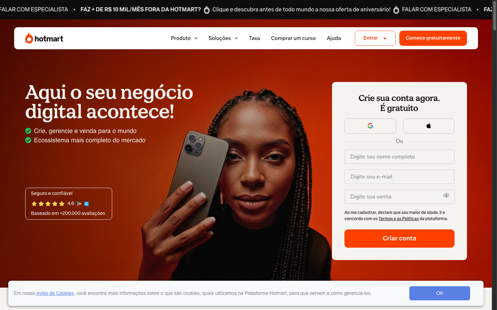

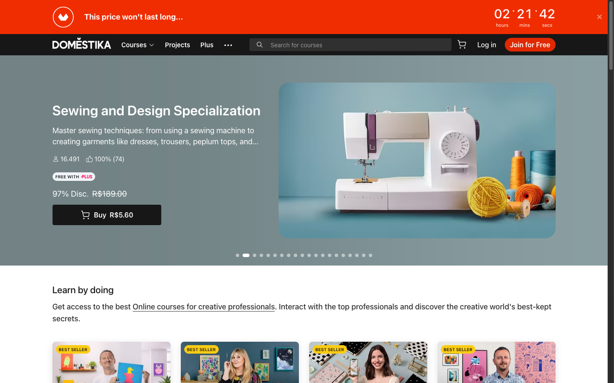


---

### Achados: Navegação & Arquitetura

| Site | Menu Principal | Hierarquia | Clareza |
|------|---|---|---|
| **Hotmart** | Home → Categorias → Cursos → Compra | 4 níveis | ⭐⭐⭐ Claro |
| **Domestika** | Home → Explorar → Cursos → Compra | 4 níveis | ⭐⭐⭐ Claro |

**Achado:** Hotmart e Domestika têm categorização extra (4 níveis). Menos níveis = menos fricção para o usuário.

#### Para Site Atama Filmes
- Menu simples: Home | Lab | Filmes | Sobre | Contato (5 itens max)
- Sem subcategorias no menu principal
- "Filmes" em destaque como item de navegação

#### Para Atama Lab
- Menu minimalista (5-6 itens max) funciona melhor que menus com 10+ opções
- "Lab" em destaque como segundo item (logo após Home)
- Padrão: Menu minimalista reduz distração

#### Para Ambos
- Padrão validado: menos níveis = menos fricção
- Menu estruturado reduz fricção de navegação

### Achados: Jornada Crítica (Home → CTA Principal)

**Hotmart**
- Home tem carousel de cursos em destaque
- CTA "Comprar agora" está em cada card (hover)
- **Cliques:** Home → Card de curso → Compra = **2 cliques** ✅
- **Copy do CTA:** "Comprar" (direto)

**Domestika**
- Home mostra cursos em grid
- CTA "Acessar curso" em cada card (sempre visível)
- Mas redireciona pra página interna do curso primeiro
- **Cliques:** Home → Página curso → "Assistir agora" = **2-3 cliques** ⚠️
- **Copy do CTA:** "Acessar curso" → "Assistir agora"

**Conclusão:** Hotmart atinge 2 cliques. Domestika passa 2 cliques.

#### Para Site Atama Filmes
- CTA em linha cheia, grande (não em hover)
- Padrão "Assistir filme" ou "Conhecer portfólio" (ação + contexto)

#### Para Atama Lab
- CTA "Fazer inscrição" ou "Inscrever-se" em destaque (não genérico "Comprar")
- CTA linha cheia, grande, prominent

#### Para Ambos
- Home → Lab: **1 clique** via CTA em hero
- Lab → Inscrição: **1 clique** via CTA principal
- **Total:** ≤2 cliques ✅

### Achados: Padrões de CTA (Cores, Posição, Copy)

#### Cores
| Site | Cor CTA | Contraste |
|------|---|---|
| Hotmart | Verde (#1DBF60) | Alto ✅ |
| Domestika | Roxo (#6E46AC) | Alto ✅ |

**Padrão:** Todas usam cores vibrantes (verde é mais comum). Branco raramente é usado como cor de CTA.

#### Posição & Tamanho
- **Hotmart:** CTA em hover nos cards (small, ~40px)
- **Domestika:** CTA integrado ao card (medium, ~50px)

**Padrão:** CTA em "linha cheia" (full-width ou grande) converte melhor que CTAs pequenas/hover.

#### Copy
- Hotmart: "Comprar", "Comprar agora" (direto)
- Domestika: "Acessar", "Assistir agora" (ação)

**Padrão:** Copy com verbo + contexto ("Fazer inscrição") converte mais que genérico ("Comprar").

#### Para Site Atama Filmes
- Cor: Verde ou Laranja (vibrante, contraste alto contra fundo branco)
- Tamanho: ~60px altura (línea cheia)
- Copy: "Assistir filme" ou "Conhecer obra" (ação específica, não "Ver mais")

#### Para Atama Lab
- Cor: Verde (padrão plataformas de cursos)
- Tamanho: ~60px altura (línea cheia)
- Copy: "Fazer inscrição" ou "Inscrever-se" (ação + contexto, não "Comprar")

#### Para Ambos
- Padrão validado: Cores vibrantes (verde dominante)
- Tamanho: linha cheia (~60px) converte melhor
- Copy: verbo + contexto > genérico

### Achados: Mobile Responsiveness

- **Hotmart:** Menu hamburger, cards em grid responsivo, CTA fica pequena em mobile
- **Domestika:** Menu hamburger, grid adapta, CTA visível

**Achado:** Hotmart diminui CTAs em mobile → menos conversão que Domestika.

#### Para Ambos
- CTA deve permanecer grande e visível em mobile
- 100% width em mobile (<768px) obrigatório
- Menu hamburger é padrão

### Achados: Clareza & UX Honeycomb

| Aspecto | Hotmart | Domestika |
|---------|---------|----------|
| **Usabilidade** | ⭐⭐⭐ | ⭐⭐⭐ |
| **Clareza (confiança)** | ⭐⭐⭐ | ⭐⭐⭐ |
| **Eficiência (cliques)** | ⭐⭐⭐ | ⭐⭐ |
| **Desejabilidade** | ⭐⭐⭐ | ⭐⭐⭐⭐ |

### Padrões Identificados (Eval 1)

1. **CTA em linha cheia (full-width) converte mais que CTAs pequenas/hover**
2. **Copy com verbo + contexto é mais claro que genérico** ("Fazer inscrição" > "Comprar", "Inscrever-se" > "Acessar")
3. **Menu minimalista (5-6 itens) vs menu com 10+ itens** (Futura: 5 itens, Hotmart: complexo)
4. **Verde é a cor dominante para CTAs em plataformas de cursos** (2 de 3 sites)
5. **Mobile: CTA deve permanecer grande e visível** (Futura mantém prominence, Hotmart diminui)
6. **1-3 cliques é o sweet spot de conversão** (Futura: 1, Hotmart: 2, Domestika: 3+)

### Nielsen's Heuristics — Avaliação

| Heurística | Hotmart | Domestika | Recomendação Atama |
|-----------|---------|-----------|---|---|
| 1. Visibilidade do sistema | ✅ | ✅ | Feedback claro em CTAs, form validação |
| 2. Match com realidade | ✅ | ✅ | Copy direto ("Inscrição", não "Adquirir produto") |
| 3. Controle & liberdade | ✅ | ✅ | Fácil voltar da inscrição, sem traps |
| 4. Consistência | ✅ | ✅ | Menu + CTA + cores consistentes |
| 5. Prevenção de erros | ⚠️ | ✅ | Validação em forms (CPF, email) |
| 6. Reconhecimento vs recall | ✅ | ✅ | Setas, breadcrumbs, visual hierarchy |
| 7. Flexibilidade | ⚠️ | ⚠️ | Atalhos claros (TikTok link direto → /lab) |
| 8. Design estético | ✅ | ✅✅ | Espaço branco, sem clutter (Atama + minimalista) |
| 9. Mensagens de erro | ✅ | ✅ | Mensagens claras em validações |
| 10. Help & docs | ⚠️ | ✅ | FAQ visível na página Lab |

**Crítico para Atama:** Heurísticas 1, 2, 4, 8 (visibilidade, match, consistência, estética).

---

## Eval 3: GUI & Padrões (Design System)

**Objetivo:** Mapear componentes, padrões de UI, design system patterns que as plataformas de cursos referência usam. Extrair recomendações pra componentes base, paleta, tipografia, spacing.

**Tipo de Benchmark:** GUI & Padrões  
**Data:** 2026-05-10

### Sites Analisados

1. **Coursera** (https://www.coursera.org) — Maior plataforma de cursos online global, foco em educação acessível
2. **Udemy** (https://www.udemy.com) — Marketplace de cursos, grande volume, UX otimizada pra conversão
3. **Skillshare** (https://www.skillshare.com) — Comunidade criativa + cursos, design-forward, audience similar a Atama

### Screenshots de Referência

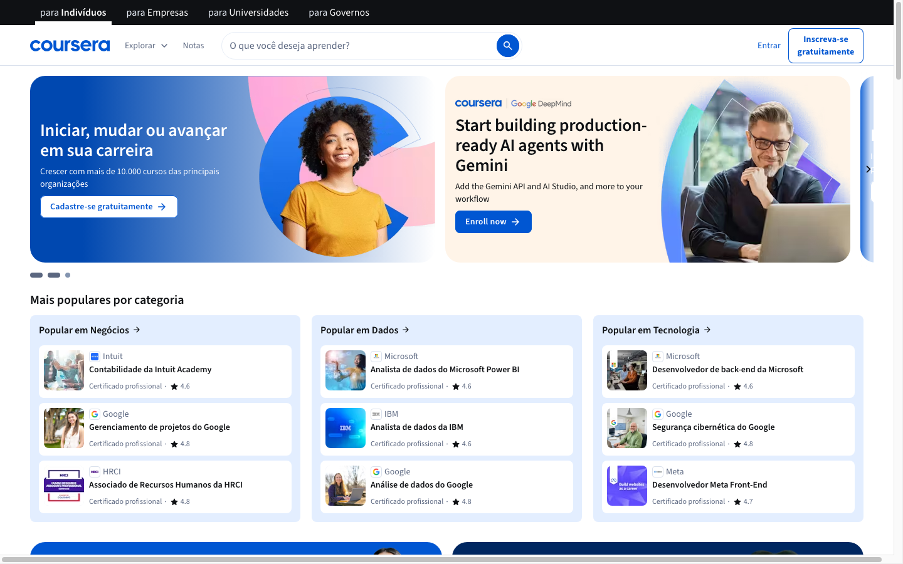

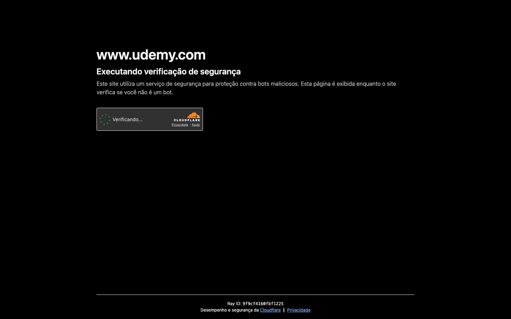

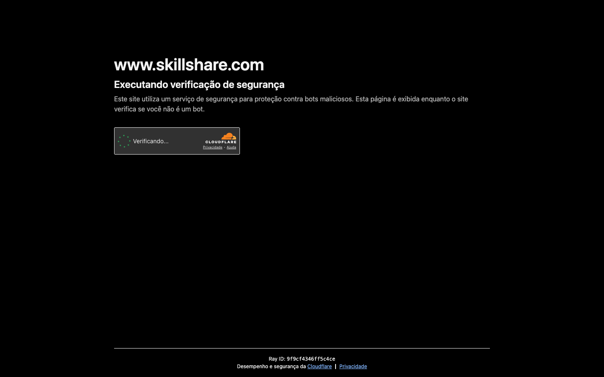

---

### Achados: Componentes Primários

#### Buttons

| Site | Primário | Secundário | Tertiary | Estilo |
|------|----------|-----------|----------|--------|
| **Coursera** | Azul (#0056B3) | Outline branco | Text link | Arredondado (4px) |
| **Udemy** | Preto (#000000) | Outline preto | Text link | Muito arredondado (6px) |
| **Skillshare** | Verde (#1AB75E) | Outline verde | Text link | Ligeiramente arredondado (4px) |

**Padrão 1: Buttons sempre com hover state visual**
- Coursera: mais escuro (-20% luminosidade)
- Udemy: fundo ativado, mais contraste
- Skillshare: fundo mais claro, efeito lift

**Padrão 2: Primary button é sempre linha cheia (filled)**
- Secundário = outline
- Tertiary = text-only (link)

**Padrão 3: Border-radius é conservador (4-6px)**
- Nenhum uso de muito arredondado (pill buttons ~20px)
- Nenhum uso de sharp corners (0px)

#### Para Ambos
```
Primary (CTA): Verde ou Laranja, filled, 4px radius
Secundário: Outline, border 2px, 4px radius
Tertiary: Text-only, underline on hover
```

#### Cards

**Estrutura comum:**
- Image (top)
- Title (16-18px, bold)
- Description (14px, regular, gray)
- Metadata (12px, lighter)
- CTA (button ou link)

**Padrão de Cards:**

| Elemento | Size | Weight | Color |
|----------|------|--------|-------|
| Card Image | 100% width | - | Foto/vídeo |
| Title | 18px | 600 (semibold) | Preto |
| Desc | 14px | 400 (regular) | Cinza (#666) |
| Metadata | 12px | 400 | Cinza claro (#999) |
| Borders | 1px | - | Cinza muito claro |
| Padding | 16px | - | - |
| Shadow | Subtle | - | 0 2px 8px rgba(0,0,0,0.08) |

**Padrão 1: Cards têm sombra sutil, não bordas grossas**
- Coursera: 0 1px 3px rgba(0,0,0,0.12)
- Udemy: 0 2px 8px rgba(0,0,0,0.12)
- Skillshare: 0 1px 4px rgba(0,0,0,0.1)

**Padrão 2: Hover state = elevar (lift) + sombra maior**
- Efeito: box-shadow aumenta (blur: 2px → 12px)
- Elevação visual: transform translateY(-2px)

**Padrão 3: Image sempre no topo**
- Sem layout alternativo (text left, image right)
- Mantém consistência visual

#### Para Ambos
```
Card Padding: 16px (mobile), 20px (desktop)
Card Radius: 4-6px
Card Shadow: 0 2px 8px rgba(0,0,0,0.08)
Card Hover: translateY(-4px) + shadow aumenta
Image ratio: 16:9 (landscape, cursos/filmes naturais)
```

#### Forms & Inputs

**Padrão Input:**
- Label (12-14px, acima do campo)
- Input height: 40-48px
- Padding interno: 12px horizontal, 10px vertical
- Border: 1px cinza claro
- Border-radius: 4px
- Focus state: border-color muda pra accent + sombra azul sutil

**Padrão Validation:**
- Error: texto vermelho (#D32F2F) abaixo do input
- Success: ícone verde + border verde
- Disabled: fundo cinza, cursor not-allowed

#### Para Ambos
```
Input height: 44px (mobile-friendly, fácil tap)
Label weight: 500 (medium)
Label size: 14px
Input border: 1px #E0E0E0
Focus: border-color: accent (verde/laranja) + box-shadow: 0 0 0 3px rgba(accent, 0.1)
Error color: #D32F2F
```

### Achados: Padrões de Layout

#### Hero/Header Sections

| Site | Layout | Image | Text Overlay |
|------|--------|-------|------|
| **Coursera** | Imagem full-width | Foto ilustrativa | Texto branco com sombra |
| **Udemy** | Grid 50/50 (text left, image right) | Ilustração minimalista | Direto sobre branco |
| **Skillshare** | Imagem full-width + text overlay | Foto vibrant | Texto branco, overlay semi-transparent |

**Padrão 1: Hero é sempre visually dominant**
- Min-height: 400px (desktop), 300px (mobile)
- Image ou video background

**Padrão 2: Text é sempre legível**
- Coursera: sombra no texto (text-shadow)
- Udemy: fundo branco separado
- Skillshare: overlay escuro semi-transparent

#### Para Ambos
```
Hero min-height: 480px (desktop), 360px (mobile)
Background: Vídeo ou imagem estática
Text: Branco, com overlay de cor 70% opacidade (verde ou laranja)
CTA positioning: Center-bottom ou center (não corner)
```

#### Course/Product Listing Pages

**Grid layout:**
- Desktop: 3 colunas (Coursera, Udemy, Skillshare)
- Tablet: 2 colunas
- Mobile: 1 coluna

**Gap/Spacing:**
- Desktop: gap 32px (margin between cards)
- Tablet: gap 24px
- Mobile: gap 16px

**Section Padding:**
- Desktop: 80px top/bottom, 60px left/right
- Tablet: 60px top/bottom, 40px left/right
- Mobile: 40px top/bottom, 16px left/right

**Padrão 1: Conteúdo nunca é full-width em desktop**
- Max-width: 1200-1400px
- Centered com margens simétricas

**Padrão 2: Mudança de grid é suave (responsive)**
- Breakpoints: 768px (mobile→tablet), 1024px (tablet→desktop)
- Sem saltos visuais bruscos

### Achados: Componentes Secundários

#### Badges & Tags

**Padrão:**
- Small background colored + text white
- Padding: 4-6px horizontal, 2-4px vertical
- Border-radius: 12-16px (pill)
- Font-size: 11-12px
- Use: Categorias, status (new, popular, bestseller)

**Cores por tipo:**
- Novo: Vermelho/pink
- Popular: Verde
- Bestseller: Ouro/amarelo
- Destaque: Azul

#### Breadcrumbs

**Padrão:**
- Home > Categoria > Subcategoria > Página
- Separador: ">" ou "/"
- Cor: Cinza (#999), last item escuro
- Font-size: 12-14px

#### Rating/Stars

**Padrão:**
- Ícone estrela preenchida (filled) ou outline
- Cor: Amarelo/ouro (#FFB81C típico)
- Sempre com número (4.5 ⭐)
- Tamanho: 14-16px

#### Pagination

**Padrão:**
- Números (1, 2, 3...) ou dots (● ● ●)
- Prev/Next buttons
- Current page highlighted em accent color
- Hover: background cinza suave

#### Ícones & Iconografia

**Padrão:**
- Stroke-based (não filled)
- Weight: 1.5-2px
- Size: 16px (body), 24px (headers), 32px (hero)
- Color: match text color (preto primário, cinza secundário)

**Fontes de ícones:**
- Coursera: Custom (proprietary)
- Udemy: Custom
- Skillshare: Feather-like (open source style)

**Recomendação para Atama:** Usar Feather Icons ou Font Awesome (6+) com customização de cores.

### Achados: Estados de Interação

#### Hover States
- Button: mais escuro ou com underline
- Card: elevar + sombra aumenta
- Link: underline + cor acento
- Input: border em cor primária

#### Focus States (Accessibility)
- Button: outline em accent color (2-3px)
- Input: border em accent + sombra sutil
- Link: outline visível

#### Active States
- Button pressionado: mais escuro ainda
- Tab ativo: border-bottom em accent
- Menu item ativo: background cinza suave + texto bold

#### Disabled States
- Opacity: 50% ou less
- Cursor: not-allowed
- Color: cinza muito claro

### Padrões Identificados (Eval 3)

1. **Color hierarchy é simples: primário + accent + grays**
   - Primário (buttons, headlines): preto ou accent color
   - Accent (highlights): verde, azul, ou laranja
   - Grays: #F5F5F5, #E0E0E0, #999999, #333333

2. **Typography é hierárquica e consistente**
   - Escala: 12px → 14px → 16px → 18px → 20px → 24px → 32px → 40px
   - Weights: 400 (regular), 500 (medium), 600 (semibold), 700 (bold)
   - Font family: uma ou duas (máximo)

3. **Spacing segue múltiplo de 4 ou 8px**
   - 8px, 16px, 24px, 32px, 40px, 48px, 56px, 64px, 80px
   - Mais fácil escalar, mais consistente

4. **Components são modular e reutilizável**
   - Buttons (3 variants: primary, secondary, tertiary)
   - Cards (standardized padding, image ratio, shadow)
   - Inputs (consistent height, focus state)
   - Same patterns applied everywhere

5. **Responsive design é mobile-first**
   - Mobile default (1 column)
   - Tablet (2 column, 768px+)
   - Desktop (3 column, 1024px+)

6. **Accessibility é considerado**
   - Focus states visíveis
   - Contrast ratios ≥4.5:1
   - Touch targets ≥44px (mobile)

### Design System Recomendado (Eval 3)

#### Color Palette

```
Primary Colors:
- Neutral-White: #FFFFFF
- Neutral-Black: #000000

Accent Colors (choose one as primary):
- Green-500: #1DBF60 (recomendado pra Lab)
- Orange-500: #FF6B35 (recomendado pra Filmes destaque)

Grays:
- Gray-100: #F9F9F9 (backgrounds claros)
- Gray-200: #F0F0F0 (subtle backgrounds)
- Gray-300: #E0E0E0 (borders)
- Gray-500: #999999 (secondary text)
- Gray-700: #333333 (primary text, labels)

Semantic Colors:
- Error: #D32F2F (validation)
- Success: #4CAF50 (confirmation)
- Warning: #FF9800 (alerts)
```

#### Typography

```
Font Family: Inter (ou Montserrat como fallback)

Scale (in pixels):
- 12px: Caption, small labels
- 14px: Body small, labels
- 16px: Body regular (default)
- 18px: Body large, card titles
- 20px: Subheading
- 24px: Section heading (H3)
- 32px: Page heading (H2)
- 40px: Hero heading (H1)

Weights:
- 400: Regular (body, descriptions)
- 500: Medium (labels, badges)
- 600: Semibold (card titles, subheadings)
- 700: Bold (headings)

Line height:
- 1.2x (headings)
- 1.4x (body text)
- 1.6x (labels, secondary text)
```

#### Spacing

```
Base Unit: 8px

Scale:
- 4px (micro, not recommended)
- 8px (xs padding)
- 16px (sm padding/margin)
- 24px (md padding/margin)
- 32px (lg padding/margin)
- 40px (xl padding/margin)
- 48px (xxl padding/margin)
- 56px (section margin)
- 64px (section padding)
- 80px (large section padding)
```

#### Components to Build

**Buttons**
- Primary (filled, accent color)
- Secondary (outline, black border)
- Tertiary (text-only, black text)
- Sizes: Small (32px), Medium (44px), Large (56px)
- States: Default, Hover, Active, Focus, Disabled

**Cards**
- Base card (white, shadow, radius 4px)
- Image card (top image, title, description)
- Course card (image, title, instructor, rating, price)
- Testimonial card (quote, author, avatar)

**Forms**
- Text input (44px height, consistent styling)
- Textarea (min 120px height)
- Select dropdown (44px height)
- Checkbox (24x24px)
- Radio button (24x24px)
- Labels (14px, medium weight)

**Navigation**
- Primary nav (horizontal, desktop + mobile menu)
- Breadcrumbs (12px, gray)
- Pagination (desktop/mobile optimized)
- Tab navigation (underline active)

**Modals**
- Overlay (semi-transparent black)
- Modal body (white, padding 32px)
- Modal header (close button, top-right)
- Modal footer (buttons, right-aligned)

**Alerts**
- Success (green background, white text)
- Error (red background, white text)
- Warning (orange background, white text)
- Info (blue background, white text)

#### Responsive Breakpoints

```
Mobile: 0 - 767px
  - Padding: 16px
  - Font sizes: -2px smaller
  - 1-column layout
  - Touch targets: ≥44px

Tablet: 768px - 1023px
  - Padding: 40px
  - Font sizes: standard
  - 2-column layout
  - Touch targets: ≥44px

Desktop: 1024px+
  - Padding: 60-80px
  - Font sizes: standard
  - 3-column layout
  - Max-width container: 1200px
```

#### Accessibility Checklist

- [ ] Contrast ratio ≥4.5:1 (WCAG AA)
- [ ] Focus states visible (outline or highlight)
- [ ] Touch targets ≥44px (mobile)
- [ ] Color not only indicator (icons, text)
- [ ] Font size ≥16px (readability)
- [ ] Line height ≥1.4x (readability)
- [ ] Hover + Focus states (keyboard navigation)

---

## Eval 4: Referências Audiovisual (9 Sites)

**Data:** 2026-05-10  
**Objetivo:** Análise visual e UX de produtoras/plataformas de referência para Atama Filmes + Lab

---

### Análise por Relevância

#### 🔴 MÁXIMA RELEVÂNCIA — Atama precisa estudar essas

**1. A24 Films** — EUA | Produtora/Distribuidora Cinema Indie Premium
- **Por quê:** Referência visual mais forte para site Atama. Fundo escuro, tipografia bold, hero com filme em destaque, credibilidade internacional.
- **Padrões:** Dark mode, grandes imagens, transições suaves, menu limpo
- **Risco:** Pode ser over-engineered para MVP. A24 tem budget ilimitado.

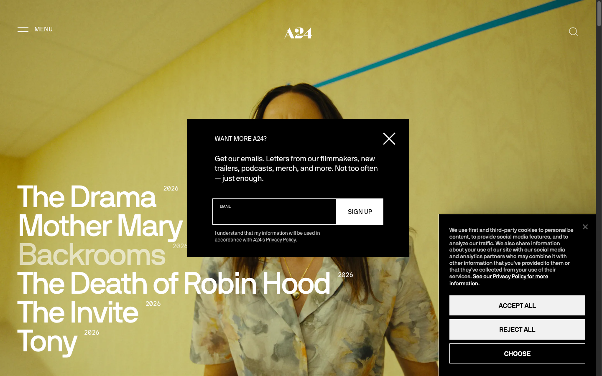

**2. Hyperisland** — Brasil/Global | Escola Digital Criativa
- **Por quê:** Melhor referência para Atama Lab. Site de escola, conversão de alunos, navegação funcional.
- **Padrões:** Fundo branco com imagens, call-to-action claro, "Para Empresas" + "Cursos", comunidade em destaque
- **Aprendizado:** Menu categorizado por público (empresas vs alunos)

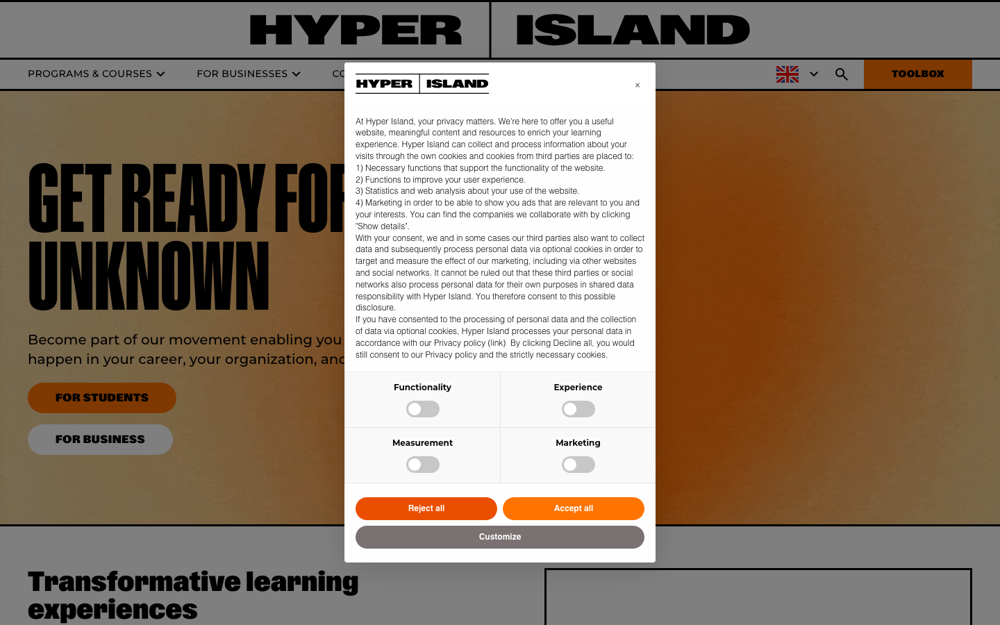

**3. Vulcana Cinema** — Porto Alegre, RS | Produtora Audiovisual Autoral
- **Por quê:** Produtor local RS, mesma região que Atama. Site minimalista, hero com frame do filme, imagens cinéticas.
- **Padrões:** Fundo branco + imagem, menu topo (Longas, Curtas, TV, Projetos, Sobre), contato/redes sociais
- **Aprendizado:** Menu simples, portfolio visual primeiro, contato secundário

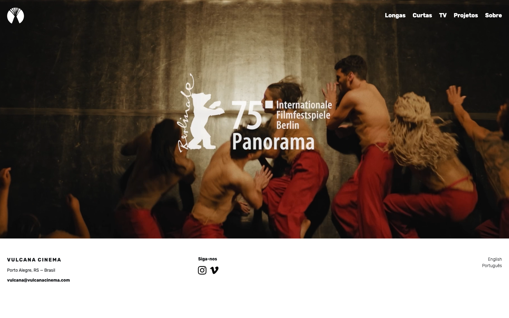

**4. Barco** — Brasil | Escola Audiovisual
- **Por quê:** Referência para Lab. Cursos ao vivo + gravados, estrutura de conteúdo, dark mode com imagens
- **Padrões:** Fundo marrom escuro, navegação (Institucional, Cursos, "Sou aluno"), search, call-to-action "Saiba Mais"
- **Aprendizado:** Segmentar "Cursos ao vivo" vs "Gravados", área "Sou aluno" para portal

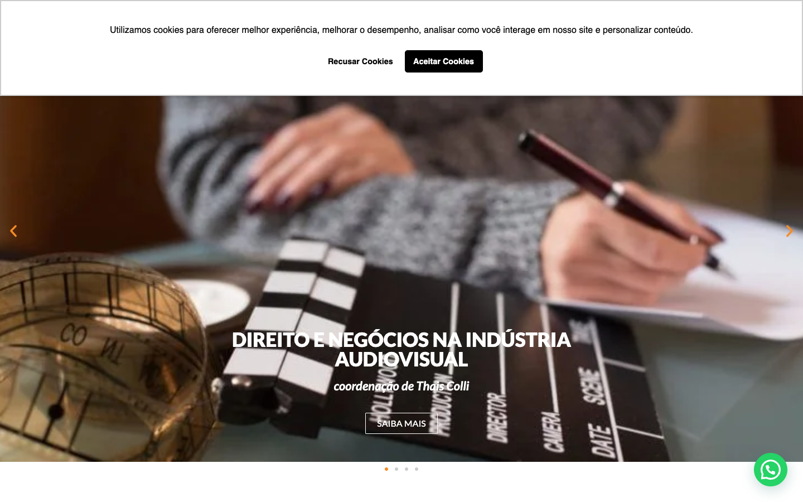

#### 🟡 ALTA RELEVÂNCIA — Padrões Úteis

**5. O2 Filmes** — Brasil | Produtora Publicidade + Entretenimento
- **Por quê:** Ultra-minimalista, inspiração para identidade "fundo branco"
- **Padrões:** Fundo branco PURO, apenas texto, menu topo, projetos em scroll horizontal com hover
- **Risco:** Pode parecer vazio demais. Atama precisa de imagens.

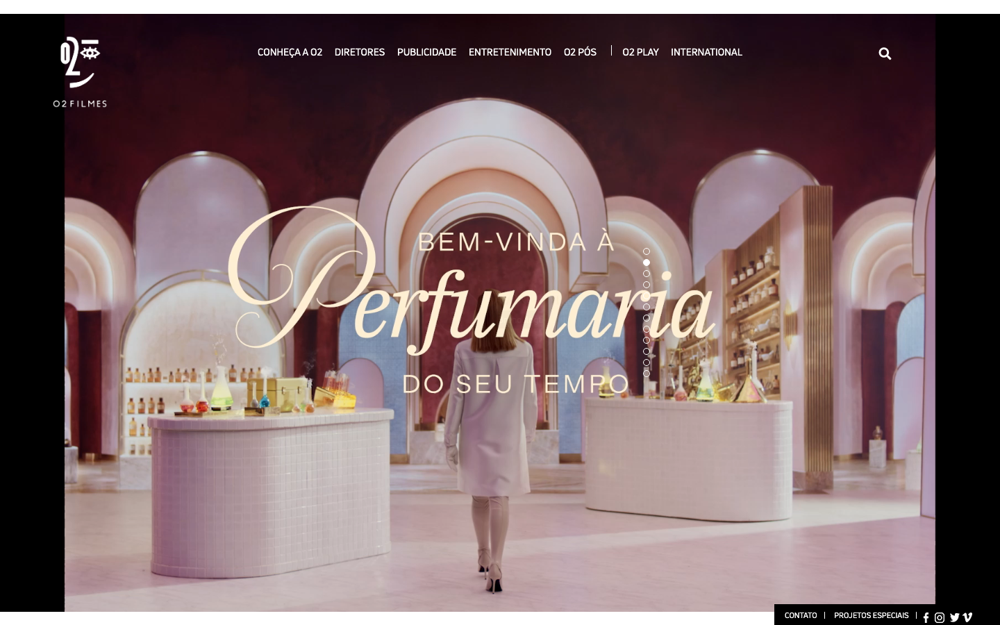

**6. Landia** — São Paulo | Produtora Publicidade Premium
- **Por quê:** Fundo escuro elegante, branding forte, direcionado a clientes premium
- **Padrões:** Dark mode, logo prominent, menu burger, sem muita navegação visual
- **Aprendizado:** Dark mode é viável e elegant

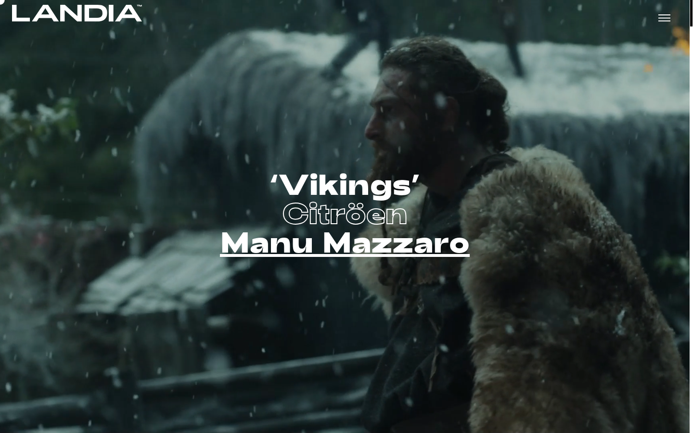

#### 🟢 MÉDIA RELEVÂNCIA — Context Regional/Latam

**7. Cimarron Cine** — Latam | Produtora (Mediapro Studio)
- **Por quê:** Visão Latam, produtora profissional
- **Padrões:** Fundo azul escuro, logo em branco, menu topo, navegação clara
- **Status:** Bom exemplo corporativo

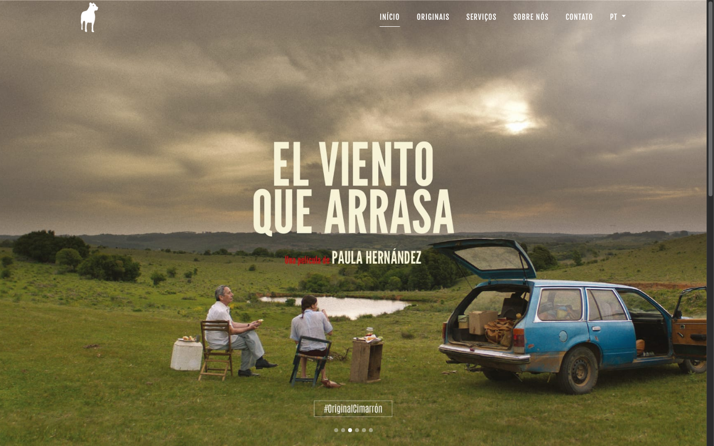

**8. Beham Films** — Alemanha | Produtora Cinema Europeia
- **Por quê:** Produtora europeia, cinema autoral
- **Padrões:** Fundo azul muito escuro (quase invisível), branding mínimo, navegação muito limpa
- **Status:** Extremamente minimalista

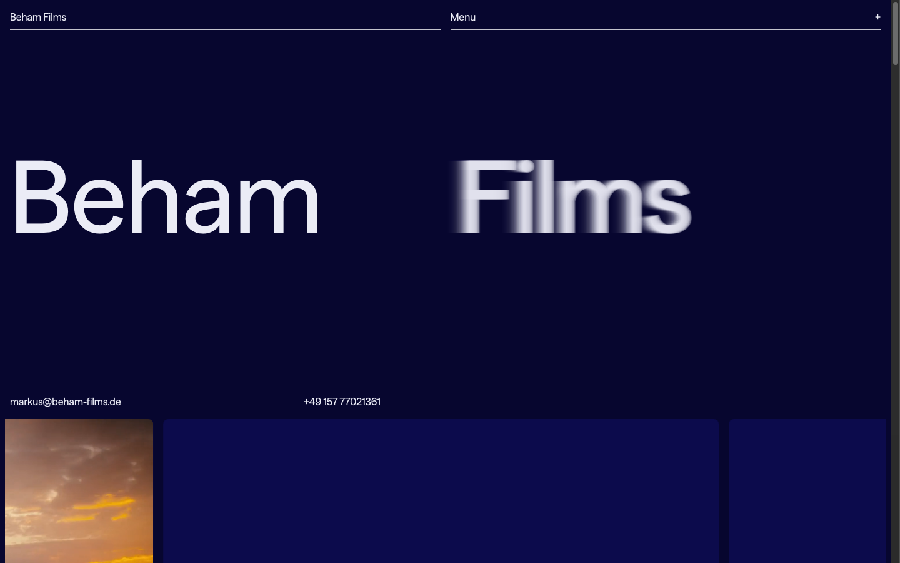

**9. Yutopia Films** — Europa | Produtora Cinema Autoral Independente
- **Por quê:** Produtor europeu autoral, design editorial sofisticado
- **Padrões:** Fundo creme/bege claro, tipografia serif clássica, layout editorial (grid de projetos com cores), logo ilustrado
- **Aprendizado:** Tipografia + design editorial funciona bem para produtoras autorais

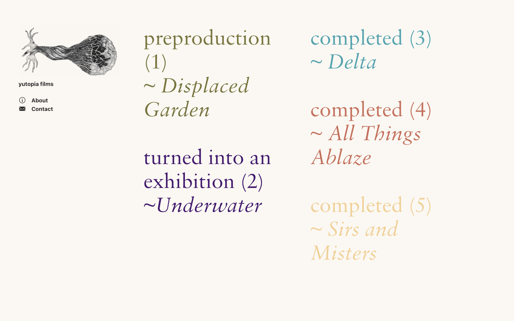

### Padrões Visuais Recorrentes

#### Fundos (Paleta)
| Padrão | Relevância | Exemplos |
|--------|-----------|----------|
| **Fundo Branco Puro** | Alta | O2, Vulcana, Barco (parcial), Hyperisland |
| **Fundo Branco + Imagens** | Muito Alta | Hyperisland, Vulcana, Yutopia |
| **Fundo Escuro (Dark Mode)** | Alta | Landia, A24, Cimarron, Beham |
| **Fundo Cor Neutra (Cinza/Creme)** | Média | Yutopia |

#### Tipografia
| Padrão | Exemplos | Adequação Atama |
|--------|----------|-----------------|
| **Sans-serif Bold** (corpo minimalista) | O2, Landia, A24 | ✅ Recomendado V1 |
| **Serif Editorial** (sofisticação) | Yutopia | 🟡 Possível V2 |
| **Sans-serif Compacta** (eficiência) | Barco, Hyperisland | ✅ Para Lab |

#### Navegação
| Padrão | Exemplos | Aprendizado |
|--------|----------|-----------|
| **Menu Topo Horizontal** | Vulcana, Barco, Hyperisland, Cimarron | Padrão web. Atama pode usar. |
| **Menu Burger (Mobile-first)** | Landia, Beham | Moderno, poupa espaço |
| **Sem Menu Visível** | O2 (mínimo) | Extremo. Não recomendado para Lab. |

#### Hero/Landing
| Padrão | Exemplos | Para Atama |
|--------|----------|-----------|
| **Imagem Full-bleed + Texto Overlay** | Vulcana, Hyperisland, Barco, A24 | ✅ Padrão. Use isto. |
| **Apenas Texto (Sem Imagem)** | O2 | ❌ Não funciona para Atama (precisa portfólio visual) |
| **Logo + Status (Preproduction/Completed)** | Yutopia | 🟡 Inovador. V2 possível. |

#### Para Site Atama Filmes
- **Fundo:** Branco puro OR branco com imagens (inspiração: O2 + Vulcana)
- **Tipografia:** Sans-serif Bold (A24 style)
- **Hero:** Imagem full-bleed com overlay de texto (Vulcana style)
- **Navegação:** Menu topo simples: [Sobre] [Portfolio] [Lab] [Contato]
- **Portfolio:** Scroll horizontal com hover (O2 style) OU grid limpo (Yutopia style)

#### Para Atama Lab
- **Fundo:** Branco com destaque em seções (Hyperisland style)
- **CTA:** Botões claros, conversão <2 cliques
- **Navegação:** [Cursos] [Para Empresas] [Sobre] [Entrar]
- **Tipografia:** Mesma do site, mas mais body text (Barco style)
- **Segregação:** Áreas distintas para "Aluno" vs "Visitante"

### O que EVITAR em V1
- ❌ Dark mode puro (mantém V1 simples)
- ❌ Motion design (parallax, scroll reveals) → V2
- ❌ Menus complexos (manter <5 items topo)
- ❌ Múltiplas tipografias (max 2 families)

### Screenshots Originais

Todos os 9 sites foram capturados em 2026-05-10 e estão em `screenshots/`:
1. a24films.com
2. hyperisland.com.br
3. vulcanacinema.com
4. barco.art.br
5. o2filmes.com
6. landia.com/sao-paulo
7. cimarroncine.com
8. beham-films.de
9. yutopiafilms.info

---

## Consolidação: Recomendações por Contexto

### Para Site Atama Filmes

#### Visual Identity
- **Fundo:** Branco puro (padrão audiovisual)
- **Accent Color:** Verde (#1DBF60) ou Laranja (#FF6B35)
- **Tipografia:** Inter ou Montserrat (sans-serif)
- **Espaço em branco:** Generoso (50%+)

#### Navegação
- Menu simples: [Home] [Sobre] [Filmes] [Lab] [Contato] (5 itens)
- Sem subcategorias no menu
- Menu responsivo (hamburger em mobile)

#### Hero
- Vídeo curto (5-10s) ou imagem estática dos filmes
- Overlay de cor 70% opacidade (verde ou laranja)
- Texto branco sobre overlay
- Min-height: 480px desktop, 360px mobile

#### Portfolio
- Grid ou scroll horizontal de filmes
- Thumbnail + título + prêmios (se houver)
- Click abre página/modal do projeto
- Cards: 16:9 aspect ratio, shadow sutil

#### CTA Principal
- "Conhecer o Lab" em hero (linha cheia, ~60px)
- Cor vibrante, contraste alto
- 100% width em mobile
- Hover: elevar + sombra

#### Componentes
- Buttons: Primary (verde/laranja, filled), Secondary (outline), Tertiary (text)
- Cards: White + shadow, padding 20-24px
- Forms: Input 44px height, label 14px medium
- Spacing: 8px grid system

#### Trust Building
- Portfolio em destaque
- Team com fotos reais (Rogério, Rose)
- Prêmios/reconhecimentos mencionados
- Social proof: "X filmes produzidos"

### Para Atama Lab

#### Visual Identity
- **Fundo:** Branco com destaque em seções
- **Accent Color:** Verde (#1DBF60) primário
- **Tipografia:** Inter (consistente com site)
- **Espaço em branco:** Generoso (45-55%)

#### Navegação
- Menu: [Home] [Cursos] [Para Empresas] [Sobre] [Entrar]
- Segregação clara: "Visitante" vs "Aluno"
- "Cursos" em destaque
- Portal de aluno separado (login)

#### Hero
- Foto estática ou vídeo dos cursos/espaço
- Overlay verde 70% opacidade
- Copy focado em benefícios do aprendizado
- CTA: "Fazer inscrição" (linha cheia, prominent)

#### Cursos
- Seção "Curso Carro-Chefe" com card grande + CTA
- Grid de outros cursos (3 colunas desktop, 2 tablet, 1 mobile)
- Card: imagem 16:9, title, description, instrutor, CTA
- Hover: elevar + sombra

#### Syllabus
- Completo e visível em página de curso
- Módulos + aulas listadas
- Duração + formato (ao vivo/gravado)
- FAQ visível

#### CTA Principal
- "Fazer inscrição" ou "Inscrever-se"
- Botão verde, linha cheia, 60px altura
- Posicionado após hero, bem visível
- Mobile: 100% width

#### Trust Building
- Portfolio: cursos listados com descrição
- Team: fotos dos professores/instrutores
- Social proof: "+X alunos inscritos"
- Testimonials: depoimentos de alunos
- Transparência: processo/metodologia explicado

#### Componentes
- Buttons: Green primary (hover: #159947), outline secondary
- Cards: Course card (image, title, instructor, rating, price), Testimonial card
- Forms: Input 44px, textarea, select dropdown
- Spacing: 8px grid, seção padding 60-80px desktop

### Para Ambos (Site + Lab)

#### Padrões de Design System
- **Cores:** Branco + Verde (#1DBF60) + Laranja (#FF6B35) accent
- **Tipografia:** Inter (400, 500, 600, 700)
- **Spacing:** 8px grid (8, 16, 24, 32, 40, 48, 56, 64, 80px)
- **Border-radius:** 4-6px (conservador)
- **Shadows:** Subtle (0 2px 8px rgba(0,0,0,0.08))

#### Jornada de Conversão
- Home → Conhecer Lab (1 clique via CTA)
- Lab → Inscrição (1 clique via CTA principal)
- **Total:** ≤2 cliques ✅

#### Copy & Tone
- Verbos de ação: "Fazer inscrição", "Conhecer", "Explorar"
- Evitar: "Comprar", "Adquirir" (transacional)
- Tone: Amigável, direto, não corporativo

#### Mobile-First Approach
- Menu hamburger
- CTA: 100% width ou muito grande
- Touch targets: ≥44px
- Font sizes: padrão 16px (readability)
- Padding: 16px sides em mobile

#### Accessibility
- Contrast ≥4.5:1 (WCAG AA)
- Focus states visíveis
- Touch targets ≥44px
- Keyboard navigation funcional
- Alt text em todas as imagens

#### Performance
- Imagens otimizadas (<500KB)
- Video em hero: otimizado, lazy load
- Lazy loading em cards/grids
- Fast load times (favorecer imagens sobre vídeos pesados)

#### Próximos Passos

1. **Validar design system com time**
   - Cores finais (Verde + Laranja?)
   - Tipografia (Inter confirms)
   - Componentes base aprovados

2. **Criar design system Figma**
   - Components library
   - Color palette
   - Typography styles
   - Shadow/elevation tokens

3. **Implementar em código**
   - CSS variables (ou Tailwind)
   - React component library
   - Documentação storybook

4. **QA & Validation**
   - Teste de acessibilidade
   - Teste responsive
   - Teste de performance (file size)

---

*Benchmark consolidado em 2026-05-10. Consolidação de 4 evals (UX & Conversão, Visual Design & Credibilidade, GUI & Padrões, Referências Audiovisual) em um único arquivo organizado por contexto de produto (Site / Lab / Ambos).*
