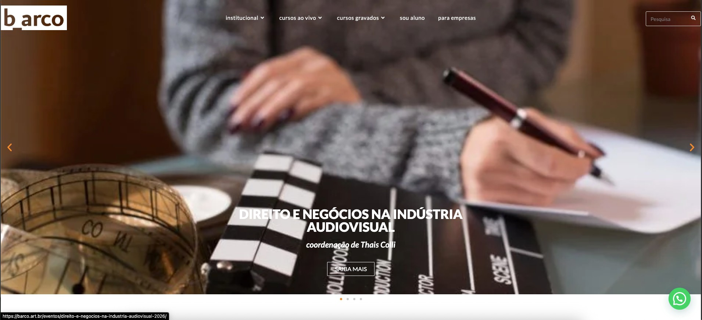

# Proposta de Design Visual e UX — Atama Filmes + Atama Lab

**Data:** 10 de maio de 2026
**Preparado por:** Nicolas (PM + Design)
**Para:** Rogério e Rose — Decisão de direção visual V1

---

## Slide 1 — O Que Estamos Decidindo Hoje

Estamos definindo a **identidade visual e a experiência de uso** do:

- **Site Atama Filmes** — vitrine da produtora para parceiros, coprodutores e festivais
- **Atama Lab** — plataforma de cursos presenciais para produtores iniciantes

**Por que isso importa agora:** Faltam 21 dias para o lançamento. A decisão de design é o desbloqueador direto para wireframes, código e produção de conteúdo. Sem isso, nada avança em paralelo.

**O que não estamos decidindo hoje:**
- Conteúdo final das páginas (textos, bio, syllabus) — esses podem ser refinados depois
- Motion design, animações, interações avançadas — isso é V2
- Identidade da marca em outras mídias (redes, materiais físicos) — fora do escopo V1

---

## Slide 2 — O Que Já Sabemos (Decisões do Kickoff, 23/04)

Estas decisões **já foram validadas por Rogério e Rose** no kickoff e servem como premissas inegociáveis desta proposta:

**Site Atama Filmes**
- Fundo branco — marca registrada visual da Atama desde o início
- Navegação simples no topo: máximo 5 itens ([Filmes] [Sobre] [Lab] [Contato])
- Muito visual, pouco textual — o portfólio fala por si
- Menos institucional, mais autoral — identidade de produtora com ponto de vista
- Teaser de prêmios e festivais — Beyond Us em San Francisco, Mostra Internacional
- Idioma: Português + Inglês (parceiros e coprodutores internacionais)
- Referências validadas: Vulcana Cinema, O2 Filmes, Volcana/Dóvo Cana

**Atama Lab**
- Apresentação e venda do Curso Carro-Chefe (produto principal V1)
- Idioma: Português apenas (público 100% brasileiro)
- KPI crítico: aluno chega à inscrição em ≤ 2 cliques
- Diferencial vs Barco: prática + mentoria + case study vivo (Evelyn) vs teoria pura

**Restrições de Projeto**
- Deadline inamovível: 31 de maio de 2026
- Dev solo: Nicolas executa design e código
- Sem motion design no V1 (parallax, transições, scroll reveals → V2)
- Budget limitado: ferramentas gratuitas ou baixo custo

---

## Slide 3 — Benchmark: O Que o Mercado nos Ensina

Analisamos **14 referências** divididas em dois grupos:

### Grupo 1 — Produtoras e Escolas Audiovisuais (9 sites)

Representam o universo visual onde a Atama se posiciona como produtora e como escola.

---

#### A24 Films — EUA | Produtora/Distribuidora Cinema Indie Premium

**O que vemos:** Design editorial com tipografia bold dominante, hero que ocupa toda a tela com imagem do filme, paleta escura (dark mode), navegação minimalista no topo. O nome do filme é o protagonista visual — não o logo da produtora.

**O que aprendemos para a Atama:**
- Tipografia como elemento de design (não só texto funcional) funciona em produtoras com portfólio forte
- Hero com imagem do projeto em destaque é mais poderoso que ilustrações genéricas
- Dark mode com imagens cinematográficas cria sensação de premium e imersão
- Risco: A24 tem orçamento ilimitado de imagens profissionais. A Atama precisa de material visual de alta qualidade para esse caminho funcionar.

---

#### Hyperisland — Brasil/Global | Escola Digital Criativa

**O que vemos:** Fundo branco limpo com imagens grandes de pessoas em atividade. Navegação clara segmentada por tipo de usuário (empresas vs alunos vs sobre). Hero com foto de ambiente de aprendizado, CTA em destaque, seções coloridas que respiram. Layout funcional orientado à conversão sem abrir mão da identidade visual.

**O que aprendemos para a Atama:**
- É possível ter um site de escola que parece sofisticado sem dark mode
- Segmentar a navegação por público ("Sou aluno" / "Para empresas") resolve ambiguidade de jornada
- Fotos de ambiente real (sala de aula, espaço de aprendizado) humanizam mais do que renders ou ilustrações
- O branco como base permite que as fotos "respirem" e se tornem o foco
- Este é o template mental ideal para o Atama Lab

---

#### Vulcana Cinema — Porto Alegre, RS | Produtora Audiovisual

**O que vemos:** Produtora local do RS com site limpo, fundo branco, hero com frame do filme em destaque. Menu topo com categorias de projeto (Longas, Curtas, TV, Projetos, Sobre). Portfólio visual como protagonista. Sem elementos decorativos supérfluos — o filme fala por si.

**O que aprendemos para a Atama:**
- Referência mais próxima geograficamente e por tipo de produtora
- Fundo branco + imagem do projeto cria contraste elegante sem precisar de dark mode
- Menu por tipo de projeto é uma arquitetura de informação inteligente para portfólio
- Mostra que produtora "de verdade" não precisa de visual over-engineered para parecer séria
- **Esta é a referência mais aplicável diretamente ao Site Atama Filmes**

---

#### Barco — Brasil | Escola Audiovisual (barco.art.br)

**O que vemos:** Fundo escuro (marrom/sépia), hero com carrossel de cursos em andamento, navegação topo com "Institucional", "Cursos ao vivo", "Cursos gravados", "Sou aluno", "Para empresas". Estrutura funcional e completa para uma escola, porém visualmente pesada e datada.

**O que aprendemos para a Atama:**
- A segmentação "Cursos ao vivo" vs "Cursos gravados" é uma decisão de IA (information architecture) importante — a Atama precisará fazer isso quando escalar
- "Sou aluno" como item de menu cria área de portal separada — boa ideia para V2
- "Para empresas" abre um segmento B2B interessante — também V2
- O dark mode aqui não parece premium — parece institucional pesado
- **O que fazer diferente:** Atama deve ser o oposto visual de Barco. Branco limpo, fotos reais de produção, linguagem mais humana e menos "escola de curso online"

---

#### O2 Filmes — Brasil | Produtora Publicidade + Entretenimento

**O que vemos:** Ultra-minimalismo radical. Fundo branco puro, apenas texto e projetos. Sem imagens decorativas, sem cores accent, sem elementos visuais que não sejam os próprios projetos. Scroll horizontal de projetos com hover revelando preview do vídeo.

**O que aprendemos para a Atama:**
- O extremo do minimal funciona para produtoras que vendem para grandes marcas e agências — o portfólio é tão forte que dispensa qualquer decoração
- Scroll horizontal de projetos é uma solução elegante para portfólio denso sem parecer uma lista
- O risco para a Atama: este nível de vazio pode parecer "site inacabado" para o público do Lab (produtores iniciantes que precisam de mais contexto e confiança)
- **Pegar emprestado:** o scroll horizontal de projetos e a confiança no espaço em branco

---

#### Landia — São Paulo | Produtora Publicidade Premium

**O que vemos:** Dark mode elegante com logo em destaque no centro, menu burger lateral, navegação muito limpa. Sem muito conteúdo na home — tudo é atmosfera e branding.

**O que aprendemos para a Atama:**
- Dark mode pode ser elegante quando a intenção é brand e não conversão
- Menu burger (ícone hamburger) é uma escolha estilística válida para produtoras que querem aparência mais contemporânea
- O risco: dark mode puro prejudica legibilidade de conteúdo educacional (textos longos, descrições de cursos) — inadequado para o Lab

---

#### Cimarron Cine — Latam | Produtora (Mediapro Studio)

**O que vemos:** Fundo azul escuro, logo centralizado, menu topo claro. Estética corporativa de grande grupo de mídia. Sem muita personalidade autoral — parece site institucional de empresa.

**O que aprendemos para a Atama:**
- O que NÃO fazer: corporativo demais perde o apelo autoral que a Atama tem como diferencial
- Fundo colorido escuro (azul, marrom) passa seriedade mas perde calor e aproximação com o público iniciante do Lab

---

#### Beham Films — Alemanha | Produtora Cinema Europeu

**O que vemos:** Extremamente minimalista — fundo quase preto, logo e menu em branco, sem imagens no hero. Cinema autoral europeu puro.

**O que aprendemos para a Atama:**
- O minimalismo extremo europeu funciona para um público de festivais e distribuidores internacionais acostumados com esse código visual
- Não funciona para o público brasileiro do Lab que precisa de contexto, explicação e confiança para se inscrever em um curso
- Útil como referência de "menos é mais" na navegação, não como modelo completo

---

#### Yutopia Films — Europa | Produtora Cinema Autoral Independente

**O que vemos:** Fundo creme/bege (#F5F1E8), tipografia serif clássica, grid de projetos com cores editoriais, logo ilustrado. Design que parece saído de uma revista de cinema dos anos 90 relida pelo olhar contemporâneo.

**O que aprendemos para a Atama:**
- Tipografia serif em produtoras cria sensação de sofisticação e historicidade — funciona bem para quem tem um portfólio com trajetória
- O bege/creme como alternativa ao branco puro é mais quente e acolhedor — interessante para uma proposta que mistura autoral com educação
- Grid editorial assimétrico (projetos com tamanhos diferentes) valoriza o portfólio de forma não genérica
- **Esta é uma referência excelente para o V2 da Atama, quando o site evoluir para editorial completo**

---

### Grupo 2 — Plataformas de Cursos Online (5 sites)

Representam as melhores práticas de conversão, componentes e UX para venda de cursos.

---

#### Hotmart — Brasil | Marketplace de Produtos Digitais

**O que vemos:** Verde como cor primária de CTA, hero com proposta de valor clara, cards de produtos com CTA visível. Jornada Home → Produto → Compra em 2 cliques.

**O que aprendemos para a Atama:**
- Valida a viabilidade técnica do KPI de ≤2 cliques — Hotmart consegue, a Atama consegue
- Verde como CTA é o padrão consolidado em plataformas de cursos — usar o mesmo cria familiaridade
- Proposta de valor no hero deve ser direta e orientada ao benefício do aluno, não à descrição do produto

---

#### Domestika — Global | Comunidade Criativa + Cursos

**O que vemos:** Grid de cursos na home, cards com instrutor em destaque, comunidade como valor central. Design mais sofisticado que Hotmart, mais próximo do público criativo.

**O que aprendemos para a Atama:**
- O instrutor como protagonista do card (foto do professor) converte melhor para cursos de alta especialização — Rogério e Rose como faces do Curso Carro-Chefe
- Comunidade como valor adicional ("você não é só aluno, você pertence a algo") — pode ser explorado no pitch do Lab

---

#### Udemy — Global | Marketplace de Cursos Técnicos

**O que vemos:** Grid denso de cursos, filtros por categoria, foco em volume e variedade. Black and white como paleta principal com amarelo como accent.

**O que aprendemos para a Atama:**
- O modelo Udemy (marketplace de volume) é o oposto do que a Atama deve ser — um curso especializado, presencial, com curadoria
- Usar o preto como CTA (estilo Udemy) seria uma opção diferente do verde dominante — mais editorial, mais premium
- O risco do preto: menos energia de "ação" que o verde

---

#### Skillshare — Global | Comunidade Criativa + Assinatura

**O que vemos:** Verde vibrante (#1AB75E) como cor primária, hero com comunidade criativa, modelo de assinatura. Público criativo similar ao da Atama.

**O que aprendemos para a Atama:**
- Público-alvo mais próximo da Atama entre as plataformas analisadas — pessoas que querem aprender criação, não só habilidade técnica
- Verde similar ao que recomendamos (#1DBF60) — valida a escolha
- A comunicação de "comunidade de criadores" é um ângulo que a Atama pode explorar no Lab

---

#### Coursera — Global | Plataforma de Educação Formal

**O que vemos:** Azul institucional, parceria com universidades, foco em certificação e carreira. Design sóbrio e confiável.

**O que aprendemos para a Atama:**
- O modelo Coursera (formal, certificação, carrreira) é muito diferente da proposta do Lab
- O azul corporativo não combina com a identidade autoral da Atama
- Útil como referência de componentes de UI (inputs, formulários, cards de curso com rating)

---

## Slide 4 — Onde a Atama se Posiciona vs Concorrência

| | **Atama** | Barco | Vulcana | O2 |
|---|---|---|---|---|
| **Público Site** | Parceiros, festivais, distribuidores | Profissionais AV | Festivais, parceiros | Agências, marcas |
| **Público Lab** | Produtores iniciantes RS/Brasil | Profissionais AV | — | — |
| **Diferencial** | Prática + mentoria + autoral | Cursos gravados (teórico) | Produtora local RS | Produtora publicidade |
| **Paleta** | **Branco + verde** | Dark marrom | Branco minimal | Branco ultra-minimal |
| **Oferta formativa** | Presencial + vivência + case study | Online gravado | — | — |
| **Preço** | Premium (turmas exclusivas) | Acesso online variável | — | — |

**Conclusão estratégica:** Fundo branco + visual autoral + verde como único accent nos diferencia de Barco (dark escolar, online, genérico) e nos alinha com as produtoras de referência que queremos ter como pares. O design precisa comunicar: **"somos produtores que ensinam o que sabemos fazer de verdade"** — não uma escola de cursos online.

---

## Slide 5 — As 3 Opções de Direção Visual

As propostas a seguir foram construídas a partir da síntese do benchmark com as premissas do kickoff. Cada opção representa uma aposta diferente de **onde a Atama quer ser vista no mercado**.

---

## Slide 6 — OPÇÃO A: "Autoral Minimal"

**Inspiração principal:** Vulcana Cinema (Site) + Hyperisland (Lab)
**Referências de apoio:** O2 Filmes (portfólio), Hotmart (conversão Lab)

**Conceito central:** A Atama é uma produtora com voz própria que decidiu ensinar. O site comunica isso — o portfólio é o protagonista, a identidade é construída pelas obras, não pelos elementos decorativos. O Lab é uma extensão natural dessa autoridade: "aprenda com quem produz de verdade."

---

### Site Atama Filmes — Como ficaria

**Hero (seção de entrada)**
- Imagem full-bleed de um frame de Beyond Us ou outro projeto forte
- A imagem ocupa toda a largura — mas com respiro: não escurece tudo, mantém relação com o branco
- Sobre a imagem: nome do filme em tipografia Roboto Bold 48px, branco
- Abaixo: linha de prêmios em Roboto Regular 16px ("San Francisco International Film Festival · Mostra Internacional")
- CTA secundário: "Conheça o Lab →" em botão outline branco discreto no canto direito
- Sem exagero: não há vídeo em loop, não há animação — a imagem estática bem escolhida já é impactante

**Navegação**
- Logo Atama à esquerda (formato horizontal, Helvetica, como existe hoje)
- Links: [Filmes] [Sobre] [Lab] [Contato] — Roboto Medium 14px, preto
- Botão verde "Inscrever-se no Lab" no extremo direito — se destaca no mar branco
- Em scroll: header fica fixo com fundo branco 95% opacidade + sombra sutil (shadow 0 2px 8px)
- Mobile: hamburger menu, links empilhados, botão verde 100% largura no final

**Portfólio**
- Grid 2 colunas desktop, 1 coluna mobile
- Cada card: imagem 16:9 do filme, título em Roboto Bold 20px, categorias (Longa, Série, Doc) como badge cinza pequeno
- Hover: overlay branco 20% sobre a imagem + aparece bloco com prêmios ganhos (fade suave — sem JS complexo, CSS transition)
- Ordenado por relevância (Beyond Us em destaque, não cronológico)

**Sobre**
- Foto de Rogério e Rose (real, não posada demais) — lado a lado ou individual, dependendo do material disponível
- Texto: 3 parágrafos max — história da Atama, filosofia autoral, por que criaram o Lab
- Case "Comer, Beber e Aprender": bloco separado com foto de Evelyn + citação dela sobre o processo

**Contato**
- Formulário simples: Nome, Email, Mensagem
- Direto: nada de chatbot, nada de Calendly no V1
- Redes sociais em ícones

---

### Atama Lab — Como ficaria

**Hero**
- Foto real do Lab/Casa da Chácara ou dos mentores em ação (não imagem de banco)
- Overlay verde (#1DBF60) 60% opacidade sobre a foto — cria o verde como identidade do Lab
- Título: "Aprenda audiovisual com quem produz de verdade" — Roboto Bold 40px, branco
- Subtítulo: "Curso Carro-Chefe — 2 semanas, 20h de formação prática" — Roboto Regular 18px, branco 80%
- CTA principal: botão branco sólido "Inscrever-se agora" abaixo do título (não verde, porque o fundo já é verde)

**Curso Carro-Chefe — Card de destaque**
- Card grande (full-width desktop) com imagem 16:9
- Informações essenciais: Duração, Formato (presencial), Mentores (Rogério + Rose com foto), Turma (Junho 2026)
- CTA verde "Inscrever-se" grande e proeminente
- Preço (quando definido com Rogério, Rose e Marcelo)

**Por que o Lab? (seção de confiança)**
- 3 ícones + texto: "Aprenda fazendo", "Com quem produz de verdade", "Case study real"
- Card de Evelyn Fernandes: foto + "De aluna a co-realizadora" — prova social concreta do método
- Depoimento dela sobre o processo de aprendizado

**FAQ inline**
- Perguntas mais comuns sem precisar navegar para outra página
- Accordion simples (expandir/recolher) — sem JavaScript pesado
- Exemplos de perguntas: "Preciso ter experiência?", "Como funciona o espaço presencial?", "Qual o investimento?", "As turmas têm vagas limitadas?"

**Segregação de usuário**
- Visitante: vê tudo da página normalmente
- Link "Sou aluno" no menu redireciona para área de portal (V2 — no V1, pode ser um WhatsApp group link ou email de suporte)

---

### Por que esta opção é a certa para o V1?

**Alinhamento com o kickoff:** Rose pediu "fundo branco + 3 botões + simples". Rogério queria "mais visual que o site atual". Esta opção entrega os dois: é visual (imagem dominante no hero, portfólio em destaque) mas parte do branco que é a marca registrada.

**Viabilidade real em 21 dias:** Com 1 tipografia (Roboto), 1 accent color (verde), 5 componentes base e 7 páginas, é possível codificar com Next.js + Tailwind em 2 semanas com 1 semana de testes. Qualquer outro caminho compromete o deadline.

**KPI de conversão:** O branco com verde como único accent maximiza o contraste do CTA do Lab. O olho não tem concorrência — vai direto para o botão verde. Verde em fundo branco tem contraste ratio 4.5:1+ (WCAG AA).

**Base sólida para V2:** A Opção A não é o destino final — é a fundação. No V2, a Atama adiciona tipografia editorial (serif), layouts assimétricos, motion design e concorre a Awwwards. Mas para isso, precisa ter a base bem construída no V1.

**Riscos e mitigações:**
- Imagens precisam ter qualidade → Rogério precisa separar frames de alta resolução dos projetos (ação de amanhã)
- Pode parecer "genérico" se não tiver identidade na copy → a linguagem é o que diferencia — "aprenda com quem produz" vs "faça nosso curso"

---

## Slide 7 — OPÇÃO B: "Editorial Cinematográfico"

**Inspiração principal:** A24 Films + Yutopia Films
**Referências de apoio:** Beham Films (minimalismo extremo), Landia (dark elegante)

**Conceito central:** A Atama como publicação de cinema. Um site que parece uma revista de cinema contemporânea — onde a tipografia é tão importante quanto as imagens, o layout surpreende sem confundir, e a sensação é de entrar num espaço cultural único.

---

### Site Atama Filmes — Como ficaria

**Paleta**
- Fundo principal: Branco #FFFFFF
- Seções alternadas: Bege/creme #F5F1E8 (vide Yutopia)
- Texto: Preto #0A0A0A
- Accent: Vermelho editorial #CC2B2B (contraste com o bege) — diferente de qualquer concorrente

**Tipografia — sistema com dois pesos**
- Headlines: Playfair Display Bold 700 (serif — vide Yutopia, cria editorial)
- Body e UI: Roboto Regular 400 (mantém consistência com logo Helvetica)
- A tensão entre serif e sans-serif cria o "estilo editorial" sem precisar de motion

**Hero**
- Vídeo em loop silencioso (5–10s) de cena de Beyond Us — imersão cinematográfica total
- Título do filme em Playfair Display 64px sobre o vídeo
- Subtítulo: "Rogério + Rose · Atama Filmes" em Roboto 16px cinza
- Sem CTA no hero — a intenção é imersão, não conversão imediata
- Scroll para baixo revela o portfólio

**Portfólio**
- Grid editorial assimétrico: coluna grande (projeto destaque) + duas menores ao lado
- Cada projeto tem tamanho diferente — cria ritmo visual não genérico
- Hover: título do projeto em Playfair aparece centralizado sobre a imagem (sem overlay pesado)

**Sobre**
- Layout magazine: foto grande de Rogério (ou Rose) à esquerda, 50% da tela
- Texto à direita: manifesto da produtora, não bio corporativa
- Citação de festival em Playfair itálico com destaque tipográfico

---

### Atama Lab — Como ficaria

**Consistência total com o Site**
- Mesma paleta (branco + bege + preto)
- Accent muda: Playfair para títulos, verde para CTAs de inscrição (o único verde no site)
- O Lab é uma seção do mesmo universo editorial

**Linguagem mais sofisticada**
- "Reservar vaga" em vez de "Inscrever-se"
- "Turma de junho — vagas limitadas" em vez de "Curso disponível"
- "Formação presencial em audiovisual" em vez de "Curso ao vivo"

**Risco real para conversão**
- Linguagem sofisticada pode criar distância com o público do Lab (produtores iniciantes do interior do RS que vieram de editais de fomento)
- "Reservar vaga" soa mais caro e inacessível do que "Inscrever-se"
- O design premium pode intimidar o público que a Atama quer incluir

---

### Por que esta opção não é V1

**Prazo:** Um sistema tipográfico com dois pesos diferentes exige muito mais decisão de design — onde vai Playfair, onde vai Roboto, qual tamanho, qual peso. São semanas de refinamento que o V1 não tem.

**Material visual:** O vídeo em loop do hero exige edição, otimização (WebM, MP4 comprimido < 3MB), fallback para mobile. É uma dependência de produção que o prazo não comporta.

**Grid assimétrico:** Layouts não-convencionais são mais difíceis de codificar responsivamente. O que parece bonito em desktop pode quebrar completamente em mobile sem 2x mais tempo de dev.

**Conflito de público:** O Lab precisa converter produtores iniciantes. O design editorial premium é melhor para festivais e parceiros internacionais — públicos que não são o KPI do V1 (inscrições no Curso Carro-Chefe).

**Veredicto:** Esta é a Atama do V2 — quando o site já existe, já tem usuários, já tem receita, e Rogério e Rose podem alocar tempo para produzir material visual de alta qualidade para um site Awwwards-worthy.

---

## Slide 8 — OPÇÃO C: "Híbrido Funcional"

**Inspiração principal:** Hyperisland (Lab) + Vulcana Cinema (Site)
**Referências de apoio:** Hotmart (conversão), Skillshare (comunidade)

**Conceito central:** Site e Lab são dois produtos diferentes para públicos diferentes — por que forçar a mesma linguagem visual? Cada produto tem sua própria identidade, mas compartilham paleta de cores e tipografia base para manter consistência.

---

### Site Atama Filmes — Como ficaria

Igual à Opção A. Autoral, branco, portfólio em destaque. Rogério + Rose como face da produtora.

---

### Atama Lab — Como ficaria (diferente da Opção A)

**Paleta do Lab**
- Fundo: Branco com seções verdes médias (não só verde muito claro)
- Verde #1DBF60 como cor primária, não só accent
- Seções com contraste alto entre verde e branco

**Estrutura orientada à conversão**
- Hero com proposta de valor direta: "2 semanas. 20 horas. Do roteiro à produção."
- Badges de urgência: "Turma de junho · Últimas vagas"
- Tabela comparativa: Atama Lab vs cursos online vs faculdade (por que o Lab é melhor)
- Contador de vagas (não falso: mostra vagas reais restantes)
- Depoimento de Evelyn em destaque logo abaixo do hero (social proof imediato)
- FAQ com accordion
- Segunda CTA no final da página (para quem scrollou até o fim e ainda não converteu)

**Segregação explícita de usuários**
- Menu do Lab: [Sobre o Lab] [Curso Carro-Chefe] [Para Empresas] [Sou Aluno]
- "Para Empresas" abre possibilidade de B2B (formação de equipes de produtoras do RS) — oportunidade futura

---

### Por que esta opção tem problemas

**Quebra de consistência:** A decisão do kickoff foi clara — site e Lab integrados em um domínio, com uma identidade. Dois mundos visuais diferentes podem fazer o usuário sentir que mudou de empresa ao navegar de Filmes para o Lab.

**Mais componentes únicos = mais tempo:** Se o Lab tem seus próprios padrões visuais (verde dominante vs branco), Nicolas precisa codificar dois sistemas de componentes, não um. Com 21 dias, isso é inviável sem sacrificar qualidade.

**Oportunidade real desta opção:** A tabela comparativa e os badges de urgência são elementos de conversão que podem ser adicionados à Opção A sem precisar de uma identidade visual separada. São conteúdo, não design.

**Veredicto:** Os melhores elementos desta opção (urgência, comparativo, segregação de usuário) devem ser **incorporados à Opção A** como camada de conteúdo — sem mudar a identidade visual.

---

## Slide 9 — Comparativo das 3 Opções

| Critério | Opção A — Autoral Minimal | Opção B — Editorial | Opção C — Híbrido |
|---|---|---|---|
| **Alinhamento com kickoff** | ✅ Total | ⚠️ Parcial (conflita com Rose) | ⚠️ Parcial (quebra integração) |
| **Viabilidade 21 dias** | ✅ Alta | 🔴 Muito baixa | ⚠️ Média |
| **Conversão Lab (KPI crítico)** | ✅ Boa | 🔴 Risco de afastar público | ✅ Alta |
| **Diferenciação vs Barco** | ✅ Forte (oposto visual) | ✅ Máxima | ✅ Forte |
| **Consistência Site + Lab** | ✅ Total | ✅ Total | 🔴 Baixa |
| **Apelo internacional (parceiros)** | ✅ Boa | ✅ Máxima | ✅ Boa |
| **Custo de produção de material** | ✅ Baixo (fotos reais) | 🔴 Alto (vídeo, material premium) | ✅ Baixo |
| **Escalabilidade para V2** | ✅ Base perfeita para editorial | ⚠️ V2 = refazer tudo | ⚠️ Precisa de consolidação |
| **Risco de execução** | ✅ Baixo | 🔴 Alto | ⚠️ Médio |

**Recomendação:** Opção A para V1 — com os melhores elementos da Opção C incorporados como conteúdo, não como design separado.

---

## Slide 10 — Sistema Visual Proposto (Opção A)

### Cores

| Token | Hex | Uso |
|---|---|---|
| Branco | #FFFFFF | Fundo principal de todas as páginas |
| Preto | #0A0A0A | Textos primários, logo |
| Verde Lab | #1DBF60 | CTAs, botões primários do Lab, hover states |
| Verde claro | #F0F9F0 | Fundo de seções do Lab (separação sutil) |
| Cinza 100 | #F5F5F5 | Separação entre seções do site |
| Cinza 500 | #999999 | Textos secundários, captions, metadata |
| Cinza 300 | #E0E0E0 | Bordas de inputs, cards |
| Erro | #D32F2F | Validações de formulário |
| Sucesso | #4CAF50 | Confirmações, mensagens positivas |

### Tipografia — Roboto (Google Fonts)

Roboto é o "Helvetica moderno" do Google Fonts — geométrica, clean, sem serifa, profissional. Mantém consistência com o logo Atama em Helvetica sem precisar licenciar uma fonte paga.

| Elemento | Peso | Tamanho | Uso |
|---|---|---|---|
| H1 — Título principal | Bold 700 | 48px desktop / 32px mobile | Hero, páginas de entrada |
| H2 — Títulos de seção | Bold 700 | 32px desktop / 24px mobile | Seções principais |
| H3 — Subtítulos | Semibold 600 | 24px desktop / 20px mobile | Cards grandes, subsections |
| H4 — Subtítulos menores | Medium 500 | 20px | Cards, sidebars |
| Body — Texto corrido | Regular 400 | 16px | Descrições, parágrafos |
| Label — Labels e UI | Medium 500 | 14px | Formulários, menus, badges |
| Caption — Rodapés | Regular 400 | 12px | Metadata, timestamps |

### Espaçamento — Grid de 8px

Todos os espaçamentos são múltiplos de 8px para consistência visual automática:

4px (micro) · **8px** · **16px** · **24px** · **32px** · **48px** · **64px** · **80px**

### Bordas e Sombras

- Border-radius padrão: **4–6px** (conservador, não arredondado, não sharp)
- Sombra em repouso: `0 2px 8px rgba(0,0,0,0.08)` — quase imperceptível
- Sombra em hover: `0 8px 24px rgba(0,0,0,0.12)` — eleva o card visivelmente
- Hover em cards: `transform: translateY(-4px)` + sombra aumenta

---

## Slide 11 — Componentes Base V1 (5 componentes para 7 páginas)

### 1. Button (Botão)

Três variantes que cobrem todos os casos de uso:

- **Primário:** Fundo verde #1DBF60, texto branco, Roboto Medium 500 16px, altura 56px, radius 4px — para CTAs de inscrição e ações principais
- **Secundário:** Outline preto 2px, texto preto, mesma tipografia — para ações alternativas
- **Terciário:** Texto puro com underline no hover — para links de navegação contextual
- **Estados:** Default / Hover (verde escuro #159947) / Active / Focus (outline 3px) / Disabled (50% opacity)
- **Mobile:** Largura 100% — nenhum CTA pequeno em mobile

### 2. Card de Projeto / Curso

Um componente serve para portfólio e para listagem de cursos:

- Imagem 16:9 no topo (aspect ratio natural para filmes e cursos)
- Badge de categoria: cinza pill (Longa / Série / Doc / Curso ao vivo)
- Título em Roboto Bold 18px, preto, 2 linhas max (truncate com ellipsis)
- Descrição em Roboto Regular 14px, cinza #666, 3 linhas max
- Metadata em 12px cinza claro (ano, duração, instrutor)
- CTA opcional na base (apenas nos cards de curso)
- Hover: `translateY(-4px)` + sombra aumenta + imagem levemente zooma (scale 1.02)

### 3. Hero

O componente mais importante — define a primeira impressão:

- Imagem full-bleed (largura 100vw, sem margens)
- Overlay: branco 20–30% para o Site / verde #1DBF60 60% para o Lab
- Container interno com max-width 1200px, centralizado
- Título H1 sobre o overlay
- Subtítulo opcional (prêmios no Site, benefícios no Lab)
- CTA centralizado e bem visível
- Min-height: 480px desktop / 360px mobile
- Imagem: `object-fit: cover`, `object-position: center`

### 4. Navegação (Header)

- Logo Atama (SVG) à esquerda — link para home
- Links à direita: Roboto Medium 14px, preto, hover com underline verde
- Botão CTA verde "Inscrever-se" no extremo direito (apenas nas páginas do Lab)
- Fixo no scroll: `position: sticky`, fundo branco 95% + sombra sutil ao scroll
- Mobile: hamburger icon (3 linhas) → menu lateral com links empilhados + botão CTA verde 100%

### 5. Footer

- Logo + tagline breve da Atama
- Três colunas: Navegação / Lab / Redes sociais
- Redes: ícones SVG (Instagram, Vimeo, YouTube, LinkedIn)
- Copyright + créditos
- Fundo cinza muito claro #F5F5F5 (separação do conteúdo principal)

---

**7 páginas do V1 com esses 5 componentes:**

| Página | URL | Componentes usados |
|---|---|---|
| Home | `/` | Hero + Cards portfólio + Nav + Footer |
| Filmes | `/filmes` | Cards portfólio (grid) + Nav + Footer |
| Sobre | `/sobre` | Hero (foto) + texto + Nav + Footer |
| Contato | `/contato` | Form simples + Nav + Footer |
| Lab | `/lab` | Hero (verde) + Card curso destaque + FAQ + Nav + Footer |
| Inscrição | `/lab/inscricao` | Form + Button + Nav + Footer |
| Confirmação | `/lab/confirmacao` | Texto + Button secundário + Nav + Footer |

---

## Slide 12 — Jornada de Conversão (KPI: ≤ 2 Cliques)

### Jornada Principal — Aluno Potencial via Redes Sociais

**Decisão crítica de design:** O link na bio do TikTok e Instagram deve apontar para `/lab`, não para `/`. Isso elimina 1 clique desnecessário.

**Fluxo:**
1. Usuário vê post/reel no TikTok → clica no link da bio → aterra em `/lab`
2. Vê hero com benefícios do Lab e CTA "Inscrever-se"
3. Clica no CTA → checkout Mercado Pago (1 clique desde a landing)
4. Preenche dados e paga → confirmação por email

**Total do TikTok até inscrição: 1 clique**

### Jornada Alternativa — Via Home

**Fluxo:**
1. Usuário chega na Home (busca, indicação, LinkedIn)
2. Vê hero com CTA "Conheça o Lab →" ou clica em [Lab] no menu
3. Aterra em `/lab`, vê hero e CTA
4. Clica em "Inscrever-se" → checkout

**Total da Home até inscrição: 2 cliques ✅ KPI atingido**

### Jornada do Parceiro / Coprodutor

**Fluxo:**
1. Chega na Home (LinkedIn, email, festival)
2. Clica em [Filmes] → vê portfólio completo
3. Interesse → [Sobre] → conhece Rogério e Rose
4. Ação → [Contato] → formulário

**Total: 2–3 cliques — aceitável. Este público não está comprando curso, está estabelecendo parceria.**

---

## Slide 13 — Diferencial Competitivo no Design

### Atama vs Barco — O Oposto Intencional

O site do Barco nos mostra exatamente o que **não** fazer:

| Decisão de Design | Barco | Atama (Opção A) | Efeito |
|---|---|---|---|
| Fundo | Marrom escuro | Branco puro | Atama parece mais limpa, moderna, acessível |
| Hero | Carrossel automático de cursos | Imagem estática poderosa de um projeto | Atama tem autoridade de produtora, não de escola |
| Navegação | 5 itens + busca + dropdown | 4–5 itens simples | Atama tem menos fricção |
| CTA | "Saiba Mais" (genérico) | "Inscrever-se" (ação clara) | Atama converte mais direto |
| Identidade | Escola de cursos | Produtora que ensina | Posicionamento completamente diferente |

### Atama vs Plataformas de Cursos Online (Hotmart, Domestika)

Elas oferecem escala, variedade, preço acessível. A Atama oferece profundidade, autoria e presença física. O design precisa comunicar isso em segundos:

- **Hotmart e Domestika:** milhares de cursos, qualquer tema, qualquer instrutor → parece mercado
- **Atama Lab:** 1 curso específico, 2 instrutores com trajetória comprovada, espaço físico real → parece escola com curadoria

**O design da Opção A comunica curadoria:** poucas escolhas visuais, cada elemento tem peso, nada é genérico.

---

## Slide 14 — Próximos Passos com Timeline

### Semana 1 (10–17/05) — Fundação

- Aprovar direção visual (esta reunião)
- Rogério separa: frames de alta resolução dos projetos + foto de Rogério e Rose
- Wireframes baixa-fidelidade das 7 páginas (Nicolas, 2 dias)
- Definir copy base: taglines, bio, benefícios do Lab (Rogério + Rose, 2 dias)

### Semana 2 (17–24/05) — Design e Protótipo

- Design system no Figma: paleta + tipografia + 5 componentes (Nicolas, 2 dias)
- Protótipo interativo Home + Lab (Nicolas, 2 dias)
- Revisão e aprovação de Rogério e Rose no protótipo (1 reunião de 1h)
- Definir preço do Curso Carro-Chefe (Rogério + Rose + Marcelo)

### Semana 3 (24–31/05) — Implementação e Lançamento

- Codificação em Next.js + Tailwind (Nicolas, 4 dias)
- Integração Mercado Pago (Nicolas, 1 dia)
- Testes: responsivo (mobile/tablet/desktop) + acessibilidade + performance
- **Go-live: 31 de maio de 2026**

---

## Slide 15 — O Que Precisamos Decidir Hoje

**Decisão 1 — Direção visual:**
Opção A (recomendada e viável) / Opção B (V2, não agora) / Opção C (melhor incorporar elementos à A)

**Decisão 2 — Cor de accent:**
Verde #1DBF60 confirma como CTA principal do Lab?

**Decisão 3 — Material visual (desbloqueador crítico):**
Rogério tem frames de alta resolução de Beyond Us ou outro projeto para o hero? Se não, qual o plano para obter imagens de qualidade?

**Decisão 4 — Case Evelyn:**
Temos foto de Evelyn Fernandes e depoimento dela para usar na página do Lab como prova social?

**Decisão 5 — Logo Atama:**
Existe arquivo vetorial (.svg ou .ai) do logo atual? Sem ele, não há como garantir qualidade em todos os tamanhos e contextos.

---

## Resumo Executivo

| | |
|---|---|
| **Proposta** | Opção A — "Autoral Minimal" |
| **Conceito** | Produtora autoral brasileira que ensina o que produz |
| **Paleta** | Branco + Preto + Verde #1DBF60 |
| **Tipografia** | Roboto (Google Fonts) — alinhada com Helvetica do logo |
| **Componentes** | 5 base para 7 páginas |
| **KPI** | Conversão ≤ 2 cliques — validado por Hotmart, aplicável à Atama |
| **Deadline** | Entregável em 21 dias por dev solo |
| **Evolução V2** | Adicionar Opção B (editorial, serif, motion) sobre esta base |
| **Diferenciação** | Oposto visual e de posicionamento do Barco |

**Mensagem central do design:** Atama não é uma escola de cursos. É uma produtora com trajetória internacional que abre suas portas para quem quer aprender audiovisual de verdade — no espaço físico, com quem faz, a partir de projetos reais.

---

*Proposta elaborada por Nicolas — PM + Product Designer | Atama | 2026-05-10*
*Baseada em: Ata do Kickoff (23/04), Refinamento do Kickoff, Benchmark Visual UX (10/05), Business Context, KPIs e Fluxograma de Produto*
