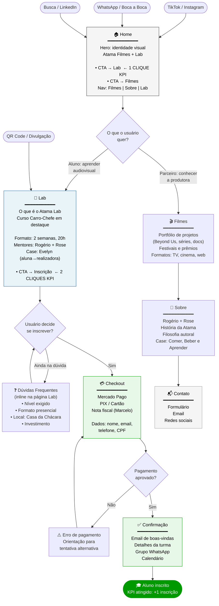

# Fluxograma — Estrutura Inicial do Projeto Atama

**Responsável:** Nicolas (PM + Design)
**Versão:** V1
**KPI validado:** Conversão site → Lab em menos de 2 cliques

---

## Premissas

- **Duas personas distintas** com jornadas diferentes no mesmo site
- **KPI crítico:** usuário chega ao checkout em ≤ 2 cliques a partir de qualquer ponto de entrada
- **Único domínio:** site institucional e Lab integrados
- **V1 sem motion design** — estrutura e conteúdo, não efeitos visuais

---

## Personas

| Persona | Quem é | Objetivo no site | Canal de entrada |
|---------|--------|-----------------|-----------------|
| **Parceiro** | Distribuidor, coprodutor, festival, imprensa | Conhecer a produtora, ver projetos, estabelecer contato | Busca, indicação profissional, LinkedIn |
| **Aluno Potencial** | Produtor iniciante do RS/Brasil, pós-LPG, sem formação formal | Entender o Lab, inscrever no Curso Carro-Chefe | TikTok, Instagram, WhatsApp, boca a boca |

---

## Fluxograma Principal

---

## Validação do KPI: Conversão ≤ 2 Cliques

| Ponto de entrada | Clique 1 | Clique 2 | Resultado |
|-----------------|---------|---------|-----------|
| Home | → Lab | → Inscrição/Checkout | ✅ 2 cliques |
| QR Code / Link direto | (aterrisssa no Lab) | → Inscrição/Checkout | ✅ 1 clique |
| TikTok com link na bio | → Home | → Lab (na nav) → Inscrição | ⚠️ 3 cliques |

> **Decisão de design:** o link na bio do TikTok deve apontar **diretamente para o Lab**, não para o Home. Isso garante ≤ 2 cliques para qualquer canal social.

---

## Páginas do Site V1 (mapeadas)

| Página | URL sugerida | Prioridade | Serve qual KPI |
|--------|-------------|-----------|----------------|
| Home | `/` | Alta | Conversão → Lab |
| Lab | `/lab` | **Crítica** | Inscrições + Conversão |
| Filmes | `/filmes` | Média | Credibilidade (parceiros) |
| Sobre | `/sobre` | Média | Credibilidade (parceiros) |
| Contato | `/contato` | Baixa | Parceiros |
| Checkout | `/lab/inscricao` | **Crítica** | Pagamento funcional |
| Confirmação | `/lab/confirmacao` | Alta | Inscrições |

**Total: 7 páginas para o V1.**

---

## Dependências identificadas

| Dependência | Bloqueia | Owner | Status |
|-------------|---------|-------|--------|
| Definir plataforma de cursos (Hotmart, Kiwify, própria) | URL de checkout, integração de pagamento | Nicolas + Discovery | ⚠️ Pendente |
| Validar serviço de pagamento (Mercado Pago) | Checkout funcional | Nicolas + Marcelo | ⚠️ Pendente |
| Confirmar espaço Lab (Casa da Chácara) | Copy e detalhes da página Lab | Rose + Laura | ⚠️ Pendente |
| Definir preço do Curso Carro-Chefe | Copy do CTA + checkout | Nicolas + Rogério + Rose | ⚠️ Pendente |
| Syllabus do Curso | Conteúdo da página Lab | Rogério + Rose | ⚠️ Pendente |

> **Crítico:** a decisão de plataforma de cursos bloqueia TODO o backlog técnico do V1.

---

## Próximos passos gerados por este fluxograma

1. **[Discovery] Validar plataforma de cursos** — desbloqueador técnico #1
2. **[Discovery] Validar serviço de pagamento** — validar Mercado Pago com Marcelo
3. **[Site V1] Wireframes e Protótipo** — este fluxograma é o input direto
4. **Decisão de link da bio** nas redes sociais → apontar para `/lab`, não `/`

---

*Gerado em 2026-05-03 — Nicolas (PM + Design) com Claude Code*
